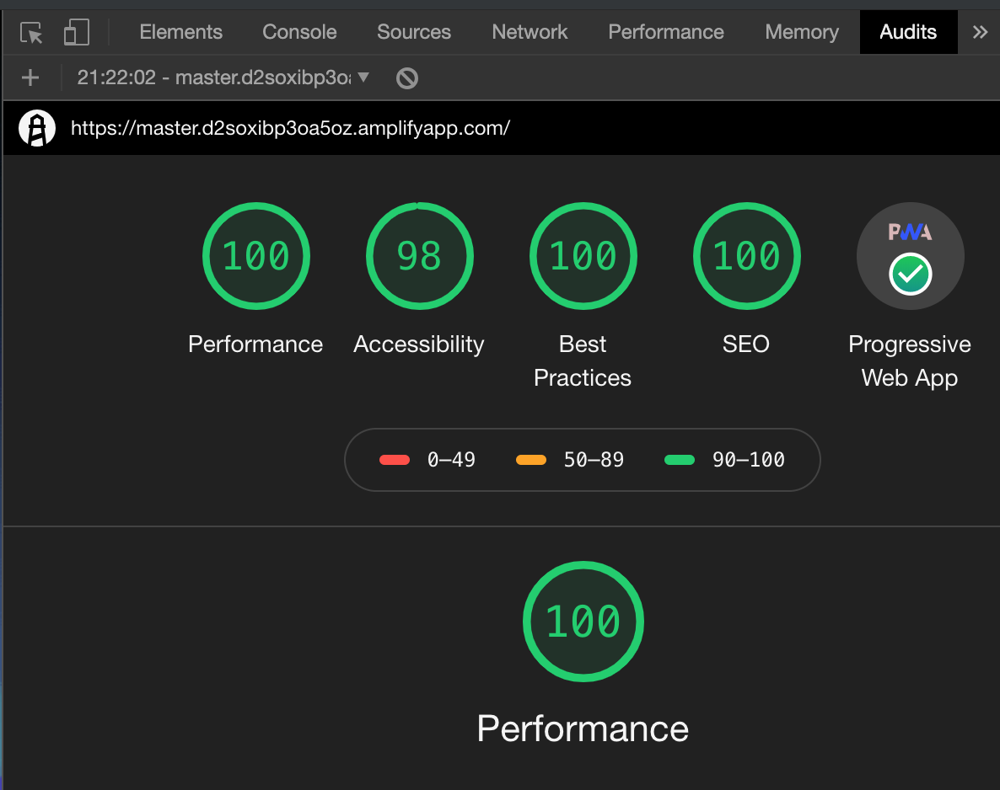

# Why? 
So it's not hard to build a slick website these days with template builders like [Squarespace](https://www.squarespace.com/), which i'd recommend for anyone looking to get going quickly....just another line item on your credit card...

However on a noble quest to learn a few new frontend development skills and what the heck the cool kids are doing in Javascript frameworks, i thought i'd build a modern blog and deployment pipeline ~ voila few weeks later i've learned tonnes that i'm proud to share. 

# Objectives

Whilst lacking in UX/UI design skills  - i still hold myself to an unreasonably high standard on cost optimisation (tight a$$) web performance and security. 

1. **Lowest possible cost** -  to build and host as static site
1. **Fastest possible performance** - make any CDN guru smile
1. **Secure** - no Wordpress SQL injection attacks please
1. **Mobile first** - no discussion required here
1. **Components based** - leverage best practices and get my head around React JS
1. **Easy** - at least to maintain and update content with a modern DevOps CI/CI pipeline

# The Solution

> * [Gatsby JS](https://www.gatsbyjs.org/)
> * [AWS Amplify](https://aws.amazon.com/amplify/)
> * Markup on Github

It'd be easy to spend months just reviewing all the latest web frameworks and tools - it's clear the world has moved on from my old friend Wordpress (though arguably Wordpress headless CMS is the way to go).

It quickly became clear that [JAM stack](https://jamstack.org/) is where it's all at now - see [Smashing](https://www.smashingmagazine.com/2019/06/jamstack-fundamentals-what-what-how/)

Looking into all these hot new JS projects - [VueJS](https://vuejs.org/), [Hugo](https://gohugo.io/) and [Nuxt](https://nuxtjs.org/) - i stumbled on Gatsby JS and haven't looked back. A comparison between frameworks is [here](https://www.gatsbyjs.org/features/jamstack/gatsby-vs-nextjs-vs-nuxtjs)

So [Gatsby JS framework](https://www.gatsbyjs.org/) is my weapon of choice and the delightful documentation meant i was up and running faster then i imagined 

# Results
So after a lot of trial and error (aka the beauty of forking someone elses hard work off Github) - nailed it! These results i reckon speak for themselves

## Ludicrous Fast - 100% Lighthouse score
Perfect performance audit score of 100% - earns real cred here from serious Web Dev's!! 

If you haven't discovered in Chrome Developer mode - [Lighthouse](https://developers.google.com/web/tools/lighthouse) is free and useful to benchmark any site as well as simulating slower networks (3G/4G) using throttling

Google SEO does favour performance and plenty of reseach on users attention span for page loads being far shorter then any goldfish 

## Free

The beauty of Github! Having decided on a framework, there is certainly no shortage of far cleverer folks with beautiful templates just needing CSS tweaks. Kudos to [Greg Lobinski](https://github.com/greglobinski/gatsby-starter-hero-blog) which i forked as the basis to get familiar and site running fast with heaps of useful web components baked in.

Settled on Hosting with [AWS Amplify](https://aws.amazon.com/amplify/) which conveniently made deployment a breeze - highly recommending reviewing for any CI/CD pipelines - not too long ago this was the domain of the DevOps superstar. Today - its free and fast. Having said that [Netlify](https://netlify.com) is absolutely amazing and i would consider if needed more dynamic content and wasn't so vain about leaving options open for CDN configuration and DevOps processes.

Hosting a Progressive Web App using AWS Amplify is effectively dumb storage (a S3 bucket with HTTP server) with Cloudfront CDN - at the modest volumes this site gets (ok make that miniscule), the bill if any is in  cents per month.

## Secure

The short version is that Gatsby is ridiculously secure and any vulnerabilities do get patched 

Enjoy this guide to [Gatsby security](https://www.gatsbyjs.org/blog/2019-04-06-security-for-modern-web-frameworks/) but the key point is that static sites using API (headless CMS) is a bulletproof architecture. 

Cloudfront TLS all the way and should i need WAF rules

Tempting to switch to Fastly - but that will be another post for sure

## Mobile

## Easy

```javascript
import { createMuiTheme } from "material-ui/styles";
import Color from "color";
import colors from "./colors";
```

# Annex 

Credit to [HeroBlog](https://github.com/greglobinski/gatsby-starter-hero-blog), a [GatsbyJS](https://www.gatsbyjs.org/) starter.

### Features included

* Easy editable content in **Markdown** files (posts, pages and parts)
* **CSS** with `styled-jsx` and `PostCSS`
* **SEO** (sitemap generation, robot.txt, meta and OpenGraph Tags)
* **Social** sharing (Twitter, Facebook, Google, LinkedIn)
* **Comments** (Facebook)
* **Images** lazy loading and `webp` support (gatsby-image)
* Post **categories** (category based post list)
* Full text **searching** (Algolia)
* **Contact** form (Netlify form handling)
* **RSS** feed
* 100% **PWA** (manifest.webmanifest, offline support, favicons)
* Google **Analytics**
* App **favicons** generator (node script)
* Easy customizable base **styles** via `theme` object generated from `yaml` file (fonts, colors, sizes)
* React **v.16** (gatsby-plugin-react-next)
* **Components** lazy loading (social sharing)
* **ESLint** (google config)
* **Prettier** code styling
* Webpack `BundleAnalyzerPlugin`
